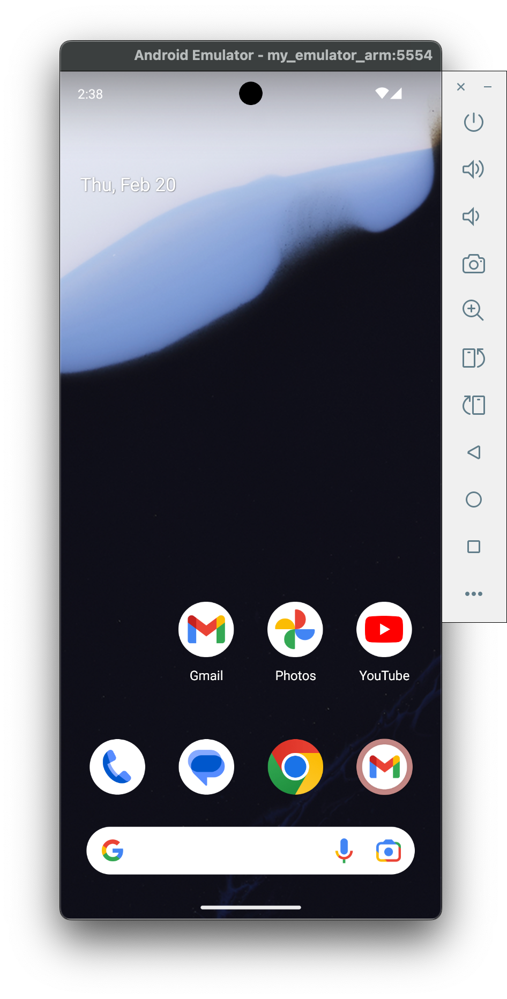

# Ryan (React) Native
Panduan dalam mempersiapkan env riek natip yang bikin pusing pala, so ini beberapa rangkumannya. yang sekiranya memiliki case yang sama semoga bisa membantu 😅🙏

### 1. Set Up Environment
- [x] Makesure development OS yang digunakan (MacOS, Windows, Linux) disini gw pake MacOS
- [x] Target OS (Android, IOS)

### 2. Set Up Environment
- [x] Ada opsi untuk menginstall watchman, cukup ikuti perintah
```bash
brew install watchman
```
- [x] Install JDK. bisa pakai opsi OpenJDK dari Zulu cukup pake Homebrew
```bash
brew install --cask zulu@17

# Get path to where cask was installed to find the JDK installer
brew info --cask zulu@17

# Navigate to the folder
open /opt/homebrew/Caskroom/zulu@17/<version number>
```
setelah terbuka foldernya, perlu install terlebih dahulu JDKnya. Setelah itu, jangan lupa tambahin path nya
```bash
export JAVA_HOME=/Library/Java/JavaVirtualMachines/zulu-17.jdk/Contents/Home
```

### 3. Install Android Devices
Akhirnya sampai di tahap ini. Sebenarnya untuk opsi ini kalo gak mau ribet, cukup aja install Android Studio and everything almost done, but Android Studio terlalu gede kalo lu hanya pengen jalanin emulatornya aja. mending install emulator manual aja, walau agak ribet sedikit
- Install Android SDK a.k.a SDK Manager ➡️ buat dulu directory untuk SDK manager
```bash
# install sdk manager
mkdir -p ~/Library/Android/sdk/cmdline-tools/latest
cd ~/Library/Android/sdk/cmdline-tools/latest
curl -O https://dl.google.com/android/repository/commandlinetools-mac-11076708_latest.zip
unzip commandlinetools-mac-11076708_latest.zip
rm commandlinetools-mac-11076708_latest.zip

# liat path sdkmanager makesure seperti ini
# /Library/Android/sdk/cmdline-tools/latest/bin/sdkmanager ✅
find ~/Library/Android/sdk -name "sdkmanager"

# jika ternyata pathnya tidak, mungkin hasilnya seperti ini
# Library/Android/sdk/cmdline-tools/latest/cmdline-tools/bin/sdkmanager ❌
# bisa dilakukan perbaikan path dengan perintah
mv ~/Library/Android/sdk/cmdline-tools/latest/cmdline-tools/* ~/Library/Android/sdk/cmdline-tools/latest/
rm -rf ~/Library/Android/sdk/cmdline-tools/latest/cmdline-tools


```
- Set pathnya di shell profile 
```bash
echo 'export ANDROID_SDK_ROOT=$HOME/Library/Android/sdk' >> ~/.zshrc
echo 'export ANDROID_HOME=$HOME/Library/Android/sdk' >> ~/.zshrc
echo 'export PATH=$ANDROID_SDK_ROOT/cmdline-tools/latest/bin:$ANDROID_SDK_ROOT/platform-tools:$ANDROID_SDK_ROOT/emulator:$PATH' >> ~/.zshrc
source ~/.zshrc
```
- Makesure pathnya sdh benar
```bash
echo $ANDROID_SDK_ROOT
...
/Users/pace/Library/Android/sdk
```
- Install Komponen SDK yang diperlukan
```bash
# install sdk komponen
sdkmanager --install "platform-tools" "emulator" "cmdline-tools;latest" "platforms;android-33" "system-images;android-33;google_apis;arm64-v8a"
```
- Creating Android Emulator (AVD)
```bash
# create avd
avdmanager create avd -n my_emulator_arm -k "system-images;android-33;google_apis;arm64-v8a" --device "pixel_6"

# run avd
emulator -avd my_emulator_arm
```
- And finally, apabila semua berjalan dengan baik, maka emulatornya akan berhasil dijalankan seperti ini
<figure>
    
</figure>